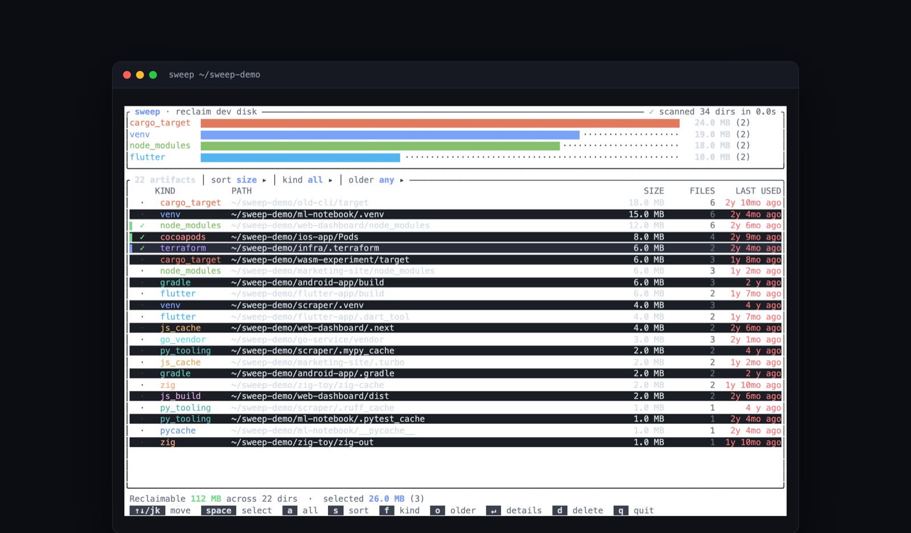

# sweep

**Find the tens of gigabytes of build caches hiding on your dev machine, and reclaim them safely.**



## Why

Every machine that has ever run `npm install`, `cargo build`, `python -m venv` or Xcode is
quietly storing the build output of projects nobody has opened in a year. It is not one big
folder you can spot in Finder — it is three hundred small ones, scattered, each named
something you are not sure is safe to delete.

`sweep` finds them, proves they are regenerable, tells you how long ago anyone actually
touched the project, and moves the ones you pick to the Trash.

Every artifact it reports can be recreated by a command you already know: `npm install`,
`cargo build`, `pod install`, `terraform init`.

## What it found on one real machine

A read-only scan of a working developer's home directory, on a 10-core M-series Mac:

```
$ sweep scan ~
  cargo_target  ████████████████████████    7.4 GB (2)
  node_modules  ███████████████████████▉    7.4 GB (69)
  venv          ███████▊················    2.4 GB (5)
  js_cache      ████····················    1.2 GB (7)
  pycache       ▏·······················   30.7 MB (130)
  js_build      ▏·······················   20.5 MB (12)

  Reclaimable 18.4 GB across 226 dirs / 705,497 files · scanned 10,226 dirs in 3.9s
```

Sizes are base-1024 with the familiar `KB`/`MB`/`GB` labels — `7.4 GB` here is
7.4 GiB, the same number `du --apparent-size -h` prints.

Eighteen gigabytes and seven hundred thousand files, from **10,226 directory reads** — because
the walk stops at every match instead of descending into all 705,497 files. The five biggest:

| size | files | kind | path |
| --- | --- | --- | --- |
| 6.6 GB | 15,976 | `cargo_target` | `~/projects/mixpilot/apps/desktop/src-tauri/target` |
| 1.1 GB | 28,795 | `venv` | `~/Desktop/work/Jobs/ugc-edit/.venv` |
| 1.0 GB | 101,901 | `node_modules` | `~/Desktop/work/Signalnetiflymudita/node_modules` |
| 870 MB | 7,955 | `cargo_target` | `~/LINKEDIN PROJECTS/sweep/target` |
| 799 MB | 91,275 | `node_modules` | `~/.hermes/hermes-agent/node_modules` |

Two notes on those numbers, because both were bugs before they were features.

**Tool installs are not your build output.** A VS Code extension really does ship a
`node_modules` next to a `package.json`, and `~/.npm/_npx` really does look like a project.
Counting them added 1.7 GB and 513 rows to the total and would have told you to delete parts
of your own toolchain. `sweep` skips `~/.npm`, `~/.cache`, `~/.cargo`, `~/.rustup`, `~/.vscode`,
`~/.local/share`, `~/Applications` and a dozen more, unless you point it at one explicitly.

**Apparent size, not blocks.** Spot-checking the three largest hits against `du` reproduced
`sweep`'s file counts and byte totals exactly, while `du` — which counts allocated blocks —
reported 4.3 GB for the 6.6 GB Rust `target` (APFS clones and compression) and 1.3 GB for
the 1.0 GB `node_modules`, where 101,901 tiny files each round up to a 4 KB block. Apparent
size is the honest answer to "how much is in here"; what the disk gives back can differ
either way.

## 60-second quickstart

```bash
git clone https://github.com/neelbarm/sweep && cd sweep
cargo install --path .        # or: cargo build --release

sweep                         # interactive TUI over your home directory
sweep ~/projects ~/Desktop    # or just the places you care about
sweep scan ~ --older-than 90d # non-interactive report, never deletes
```

`sweep` with no arguments scans `~`, skipping `~/Library` (except Xcode's `DerivedData`),
`/System`, `/Volumes`, the Trash, and the tool-owned directories listed above.

## Demo

```bash
make demo        # builds a throwaway tree of 13 fake projects, then scans it
make demo-tui    # the same fixture in the interactive UI
```

The fixture is built in `/tmp/sweep-fixture`; override it with
`make demo FIXTURE=/somewhere/else`, and `make clean-fixture` removes it.

The fixture deliberately includes five **decoys** — a `target/` with no `Cargo.toml`, a
checked-in `dist/`, a config directory named `env/`, an orphan `node_modules`, and a symlink
pointing at a real artifact. None of them are ever reported. That is the whole design.

## The TUI

```
╭ sweep · reclaim dev disk ───────────────────── ⠹ scanning 48,201 dirs · 9,113/s · 5.3s ╮
│ node_modules  ████████████████████████  21.4 GB (34)                                   │
│ cargo_target  ███████████████·········  13.1 GB (9)                                    │
│ derived_data  ████████················   6.8 GB (4)                                    │
╰────────────────────────────────────────────────────────────────────────────────────────╯
╭ 83 artifacts │ sort size ▸ │ kind all ▸ │ older 90d+ ▸ ─────────────────────────────────╮
│   KIND          PATH                              SIZE     FILES      LAST USED        │
│ ▌✓ node_modules ~/projects/old-dashboard/node_…  1.9 GB   41,203      2 y 1 mo ago     │
│  · cargo_target ~/code/rust-parser/target        1.2 GB    8,140         7 mo ago      │
╰────────────────────────────────────────────────────────────────────────────────────────╯
 Reclaimable 47.2 GB across 83 dirs  ·  selected 12.1 GB (9)
  ↑↓/jk  move   space  select   a  all   s  sort   f  kind   o  older   ↵  details  d  delete  q  quit
```

| key | action |
| --- | --- |
| `↑` `↓` `j` `k` | move, `PgUp`/`PgDn`, `g`/`G` for top/bottom |
| `space` | select / deselect a row |
| `a` | select every visible row (press again to clear) |
| `s` | cycle sort: size → last used → kind → path |
| `f` | cycle the kind filter through the kinds actually found |
| `o` | cycle the age filter: any → 30d+ → 90d+ → 180d+ |
| `enter` | details: the artifact's top-level contents by size |
| `d` | delete the selection — opens the confirmation modal |
| `y` / `n` | in that modal only: confirm / cancel. Nothing else confirms |
| `q` | quit |

Totals ease toward their new values as results stream in, newly discovered rows flash once,
the confirmation modal fades the table behind it, and deletion shows live progress ending in
a `✓ Reclaimed 12.4 GB` summary. Colours are truecolor with a 256-colour fallback, picked
from `COLORTERM`/`TERM_PROGRAM` at startup.

## How it works

### 1. Rules with markers

A directory is never reclaimed because of its name alone. Each rule pairs a **name** with a
**marker** that proves a build tool produced it:

| kind | directories | marker required |
| --- | --- | --- |
| `node_modules` | `node_modules` | sibling `package.json` |
| `js_cache` | `.next` `.nuxt` `.turbo` `.parcel-cache` `.cache` `.svelte-kit` | sibling `package.json` |
| `js_build` | `dist` `build` `out` | sibling `package.json` **and** gitignored |
| `gradle` | `build` `.gradle` | sibling `build.gradle[.kts]` / `settings.gradle[.kts]` |
| `flutter` | `build` `.dart_tool` | sibling `pubspec.yaml` |
| `venv` | `.venv` `venv` `env` `.env` | contains `pyvenv.cfg` |
| `pycache` | `__pycache__` | name is unambiguous |
| `py_tooling` | `.pytest_cache` `.mypy_cache` `.ruff_cache` `.tox` | name is unambiguous |
| `cargo_target` | `target` | sibling `Cargo.toml` |
| `cocoapods` | `Pods` | sibling `Podfile` |
| `derived_data` | any child | inside `~/Library/Developer/Xcode/DerivedData` |
| `go_vendor` | `vendor` | sibling `go.mod` **and** gitignored |
| `zig` | `zig-cache` `.zig-cache` `zig-out` | sibling `build.zig` |
| `terraform` | `.terraform` | sibling `*.tf` |

Run `sweep rules` to print this table with each rule's description.

`dist`, `build`, `out` and `vendor` are the dangerous names: they are output in most repos and
hand-written source in some. They are only claimed when the repository itself says they are
output — i.e. when a `.gitignore` in the project directory, or in any ancestor up to the repo
root, lists that name. The gitignore reader handles the common decorations (`/dist`, `dist/`,
`**/dist`) and deliberately ignores anything more exotic: a pattern `sweep` does not
understand means "not ignored", which means "not reclaimable". Failing safe costs you a few
megabytes; failing open costs you your source.

The first rule whose name *and* marker match wins, which is why `build` appears three times:
next to `build.gradle.kts` it is Gradle output, next to `pubspec.yaml` it is Flutter output,
and next to `package.json` it only counts when git ignores it.

### 2. A pruned, parallel walk

The walk runs across a Rayon pool. Two things keep it fast:

* **Pruning.** When a directory matches a rule, `sweep` measures it and never descends into
  it. A 60,000-file `node_modules` costs one size pass instead of 60,000 rule evaluations,
  and a `node_modules` nested inside another one is counted once, by its parent.
* **A cheap pre-filter.** Only directories whose *name* appears in some rule ever pay for a
  marker check (a `stat` or a `.gitignore` read).

Sizes are computed in parallel too, with sub-directories fanned back out to the pool. Symlinks
are never followed, so a symlinked cache is never double-counted or deleted through.

Progress — directories walked, artifacts found, bytes so far — streams over a channel, which
is what lets the TUI render a live scan instead of a spinner.

Size means **apparent size**: the sum of file lengths, the same number `du -h --apparent-size`
gives. On APFS with compression or clones, the space actually freed can differ from the
number shown.

### 3. The staleness signal

"Last used" is not the artifact's mtime — rebuilding a project you abandoned in 2023 would
make it look alive. It is the newest of:

* the newest mtime among the **project's own** top-level entries, skipping artifact
  directories and `.git` (capped at 2,000 entries, so a huge project directory cannot stall
  the scan), and
* **git activity**: the mtime of `.git/HEAD`, `.git/packed-refs`, `.git/FETCH_HEAD` and the
  loose refs under `.git/refs/heads`, which git rewrites on every commit, checkout and fetch.

That is what makes `--older-than 90d` mean "nobody has worked on this in three months",
rather than "nobody has compiled this in three months".

Two guards keep that honest. Timestamps before 2000 are archive sentinels — npm and many
tarballs stamp every extracted file with 1985-10-26 — so they are reported as `unknown`
rather than "40 y ago". And a project `sweep` cannot date never satisfies `--older-than`:
"I don't know" must not be presented as "nobody has touched it in a year".

### 4. Trash-first safety

Deletion is opt-in at three separate points: you select rows, you press `d`, and you
confirm with `y`. `y` is the only key that confirms — `d` itself never does, so a
double-tap or a held key cannot delete anything you have not read.
`clean` needs `--yes`. And by default nothing is destroyed — artifacts go to the macOS Trash
via the `trash` crate, so recovery is a right-click away. `--permanent` switches to
`remove_dir_all`, and the confirmation modal turns red and says so.

Only paths the scan produced are ever offered for deletion, and before any one of them is
removed it must pass all six checks — **re-evaluated against the filesystem at deletion
time**, not trusted from the scan, because a scan of a home directory can be minutes old by
the time a human presses the key:

1. it is not `/`, not `$HOME`, not a top-level directory, and not `~/Desktop`, `~/Documents`,
   `~/Downloads`, `~/Library`, `~/Movies`, `~/Music`, `~/Pictures`, `~/Public`,
   `~/Applications`;
2. it is inside one of the roots you gave, and is not a root itself;
3. it still exists;
4. it is not a symlink;
5. it is a directory;
6. its **marker is still there** — if the `Cargo.toml` next to a `target/` has vanished since
   the scan, the deletion is refused.

Every attempt, including refusals and failures, is appended to `~/.sweep/history.jsonl`:

```json
{"ts":1789598114,"path":"/Users/you/code/old-cli/target","kind":"cargo_target",
 "size_bytes":18874368,"file_count":6,"mode":"trash","ok":true}
```

Set `SWEEP_HISTORY` to send that log somewhere else. If the log cannot be written at all,
`sweep` says so before it deletes anything — on stderr for the CLI, in the status line for
the TUI — rather than reclaiming space with no record of it.

## CLI reference

```
sweep [ROOTS...]                 interactive TUI (default root: ~)
  --max-depth N                  limit how deep the walk goes
  --permanent                    delete instead of trashing (shown in red)

sweep scan [ROOTS...]            print a report, never deletes
  --json                         machine-readable output
  --kind node_modules,cargo_target   restrict to these kinds (see `sweep rules`)
  --older-than 90d               only projects idle this long (d/w/mo/y)
  --min-size 50MB                only artifacts at least this big
  --sort size|age|kind|path      default: size
  --max-depth N
  --all                          show every row instead of the top 40

sweep clean [ROOTS...]           reclaim space — dry run by default
  --kind / --older-than / --min-size / --max-depth
  --dry-run                      explicit no-op (the default anyway)
  --yes                          actually do it
  --permanent                    skip the Trash
  --json

sweep rules                      print the detection rules and their markers
```

`scan --json` emits `{roots, scanned_dirs, elapsed_ms, count, total_bytes, total_files,
by_kind[], hits[]}`, where each hit carries `path`, `kind`, `size_bytes`, `file_count`,
`last_used` (unix seconds) and `project_root` — enough to pipe into `jq` and build your own
policy.

```bash
# the ten biggest things you have not touched in six months
sweep scan ~ --older-than 6mo --json | jq -r '.hits[:10][] | "\(.size_bytes) \(.path)"'

# reclaim every Rust target older than a year, after reading the dry run
sweep clean ~ --kind cargo_target --older-than 1y
sweep clean ~ --kind cargo_target --older-than 1y --yes
```

## Install

```bash
cargo install --path .
```

Requires a stable Rust toolchain. Built and tested on macOS (arm64); the rules and the walk
are portable, and the Trash backend comes from the cross-platform `trash` crate.

## Development

```bash
make test      # 75 tests: rules, sizing, staleness, formatting, CLI, safety
make check     # fmt + clippy -D warnings + tests
make fixture   # regenerate the demo tree
```

The test suite builds real temporary directories for every rule — a positive and a negative
case each — and drives the actual binary for the CLI tests, including a test that proves a
dry run does not change a single path on disk.

---

MIT licensed. Planned by Claude Fable 5.1, built by a Claude Opus agent in one evening with
Claude Code.
